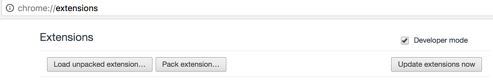
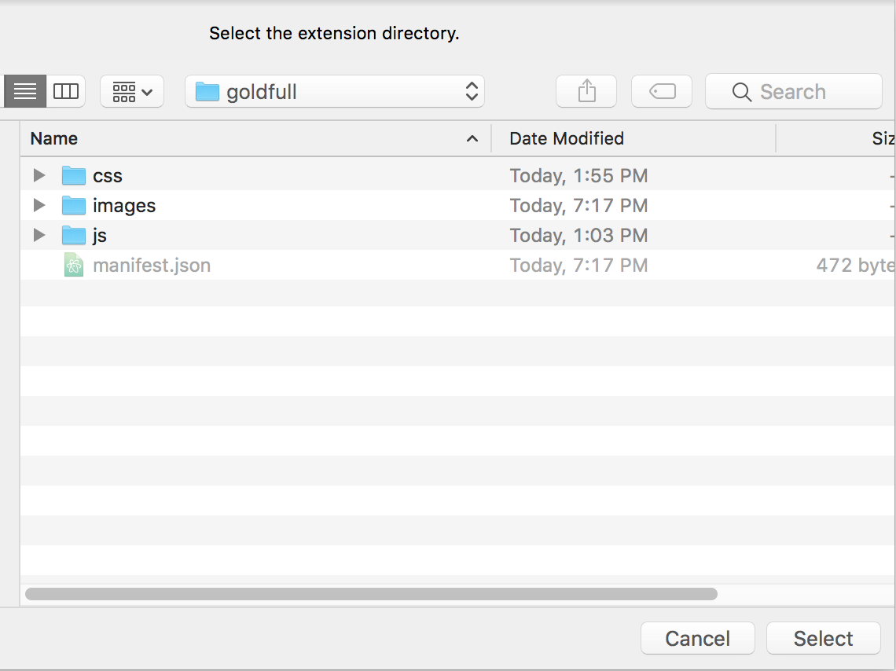

# goldfull

`goldfull` 是一个 `chrome` 浏览器插件, 它可以 **免登录** 展开稀土掘金文章的全文.

## 安装
### 下载goldfull

    git clone git@github.com:dust8/goldfull.git

### 打开chrome开发者模式
chrome --> Settings --> Extensions --> Developermode    
把 Developermode 的选项打上勾

### 载入goldfull
点击 `Load unpacked extension...`, 选择到下图目录后选择 `Select`     

### 安装成功
当出现下图就表示安装成功了

## 使用
安装成功后, 不需要任何操作.它会自动展开全文.
